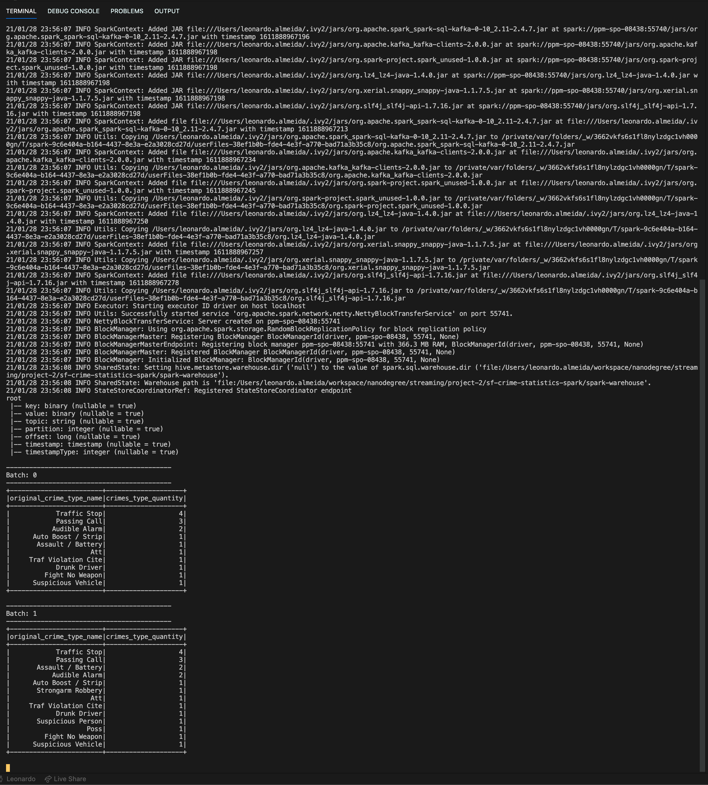
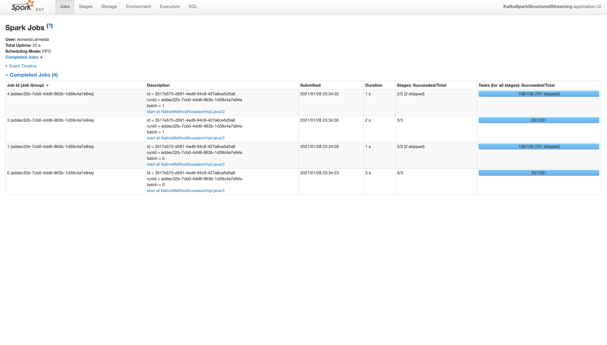
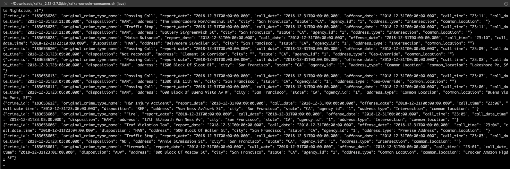

# Udacity Data Streaming Nanodegree
## SF Crimes - Spark Streaming
This repository stores the second project from Udacity Data Streaming Nanodegree using Spark Streaming.

```
├── config
│   ├── server.properties
│   ├── zookeeper.properties
├── data_stream.py
├── kafka_server.py
├── producer_server.py
├── README.md
└── requirements.txt
```

## Running and Testing

    /bin/zookeeper-server-start config/zookeeper.properties

    /bin/kafka-server-start config/server.properties

Start producer_server.py and kafka_server.py to send `police-department-calls-for-service.json` into Kafka topic
```python
python kafka_server.py
```

Run kafka console consumer
```shell
kafka-console-consumer --topic "com.udacity.sf-crimes" --bootstrap-server localhost:9092 --from-beginning
```

Run spark streaming job
```python
spark-submit --packages org.apache.spark:spark-sql-kafka-0-10_2.11:2.4.7 data_stream.py
```

---
## Questions

### Q1 - How did changing values on the SparkSession property parameters affect the throughput and latency of the data?

They will change processedRowsPerSecond parameters, so the jobs will be completed more quickly.

### Q2 - What were the 2-3 most efficient SparkSession property key/value pairs? Through testing multiple variations on values, how can you tell these were the most optimal?

- `"spark.default.parallelism" : 200`
- `"spark.sql.shuffle.partitions": 50`
- `"maxOffsetsPerTrigger": 200`

---

### Spark Streaming Console



### Spark UI



### Kafka Console Consumer
